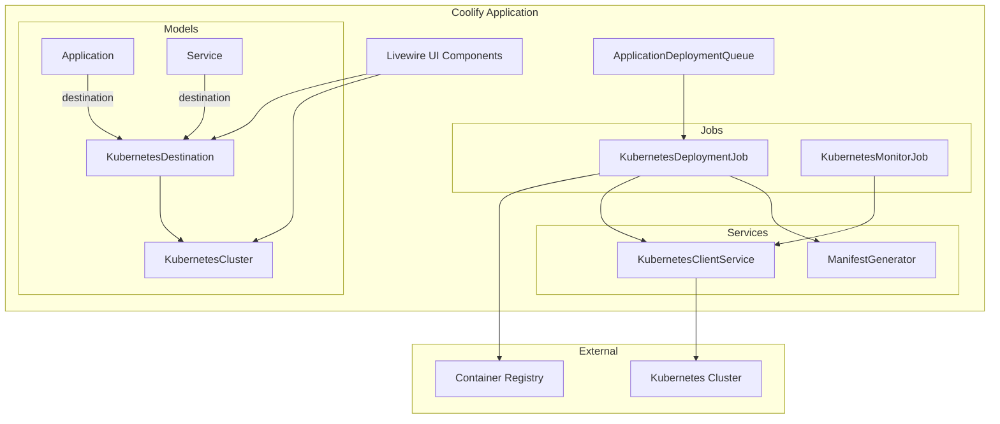
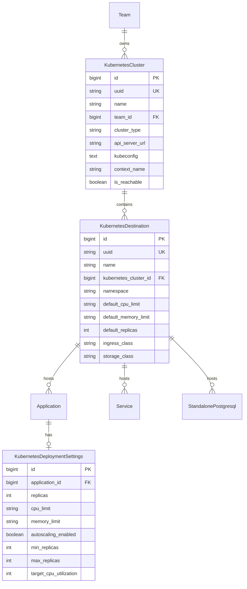

# Design Document: Kubernetes Support

## Overzicht

Dit document beschrijft het technische ontwerp voor het toevoegen van native Kubernetes/OKD/OpenShift ondersteuning aan Coolify. Het ontwerp volgt het bestaande "destination" patroon van Coolify (StandaloneDocker, SwarmDocker) en introduceert nieuwe modellen, services en jobs voor Kubernetes integratie.

De implementatie bestaat uit de volgende hoofdcomponenten:
1. **Database Modellen** - KubernetesCluster en KubernetesDestination
2. **Manifest Generator Service** - Conversie van Coolify configuraties naar Kubernetes YAML
3. **Kubernetes Deployment Job** - Deployment orchestratie naar Kubernetes clusters
4. **Livewire UI Componenten** - Cluster beheer en deployment configuratie interfaces

## Architectuur



## Componenten en Interfaces

### 1. KubernetesCluster Model

Het KubernetesCluster model beheert de verbinding met een Kubernetes cluster.

```php
<?php

namespace App\Models;

class KubernetesCluster extends BaseModel
{
    protected $fillable = [
        'uuid',
        'name',
        'description',
        'team_id',
        'cluster_type',        // 'kubernetes', 'k3s', 'okd', 'openshift'
        'api_server_url',
        'kubeconfig',          // encrypted
        'context_name',
        'default_namespace',
        'is_reachable',
        'last_checked_at',
    ];

    protected $casts = [
        'kubeconfig' => 'encrypted',
        'is_reachable' => 'boolean',
        'last_checked_at' => 'datetime',
    ];

    // Relaties
    public function team(): BelongsTo;
    public function destinations(): HasMany;
    
    // Methodes
    public function testConnection(): bool;
    public function getNamespaces(): Collection;
    public function getClient(): KubernetesClient;
}
```

### 2. KubernetesDestination Model

Het KubernetesDestination model representeert een namespace binnen een cluster als deployment target.

```php
<?php

namespace App\Models;

class KubernetesDestination extends BaseModel
{
    protected $fillable = [
        'uuid',
        'name',
        'kubernetes_cluster_id',
        'namespace',
        'default_cpu_limit',
        'default_memory_limit',
        'default_cpu_request',
        'default_memory_request',
        'default_replicas',
        'ingress_class',
        'storage_class',
    ];

    // Polymorphic relaties (zoals StandaloneDocker)
    public function applications(): MorphMany;
    public function postgresqls(): MorphMany;
    public function redis(): MorphMany;
    public function mongodbs(): MorphMany;
    public function mysqls(): MorphMany;
    public function mariadbs(): MorphMany;
    public function services(): MorphMany;
    
    public function cluster(): BelongsTo;
    public function server(): Server; // Via cluster voor compatibiliteit
}
```

### 3. KubernetesClientService

Service voor communicatie met de Kubernetes API.

```php
<?php

namespace App\Services;

use Kubernetes\Client;

class KubernetesClientService
{
    private Client $client;
    
    public function __construct(KubernetesCluster $cluster);
    
    // Namespace operaties
    public function createNamespace(string $name): void;
    public function namespaceExists(string $name): bool;
    public function getNamespaces(): array;
    
    // Deployment operaties
    public function applyManifest(string $yaml): void;
    public function deleteResource(string $kind, string $name, string $namespace): void;
    public function getDeployment(string $name, string $namespace): ?array;
    public function getDeploymentStatus(string $name, string $namespace): array;
    public function scaleDeployment(string $name, string $namespace, int $replicas): void;
    
    // Pod operaties
    public function getPods(string $namespace, array $labelSelector = []): array;
    public function getPodLogs(string $name, string $namespace, string $container = null): string;
    public function streamPodLogs(string $name, string $namespace, callable $callback): void;
    
    // Service/Ingress operaties
    public function getService(string $name, string $namespace): ?array;
    public function getIngress(string $name, string $namespace): ?array;
    
    // Events
    public function getEvents(string $namespace, string $fieldSelector = null): array;
    
    // Health checks
    public function checkApiHealth(): bool;
    public function checkRbacPermissions(): array;
}
```

### 4. ManifestGenerator Service

Service voor het genereren van Kubernetes manifests uit Coolify configuraties.

```php
<?php

namespace App\Services;

class KubernetesManifestGenerator
{
    public function __construct(
        private Application|Service $resource,
        private KubernetesDestination $destination
    );
    
    // Hoofd generatie methodes
    public function generateAll(): array;
    public function generateDeployment(): array;
    public function generateService(): array;
    public function generateIngress(): ?array;
    public function generateConfigMap(): ?array;
    public function generateSecret(): ?array;
    public function generatePersistentVolumeClaim(): ?array;
    public function generateHorizontalPodAutoscaler(): ?array;
    
    // Docker Compose conversie
    public function fromDockerCompose(string $composeYaml): array;
    
    // Export
    public function toYaml(): string;
    public function toArray(): array;
    
    // Helpers
    private function buildContainerSpec(): array;
    private function buildResourceLimits(): array;
    private function buildProbes(): array;
    private function buildVolumeMounts(): array;
    private function generateLabels(): array;
    private function generateAnnotations(): array;
}
```

### 5. KubernetesDeploymentJob

Job voor het uitvoeren van deployments naar Kubernetes.

```php
<?php

namespace App\Jobs;

class KubernetesDeploymentJob implements ShouldQueue
{
    use Dispatchable, InteractsWithQueue, Queueable, SerializesModels;
    
    public function __construct(
        public int $application_deployment_queue_id
    );
    
    public function handle(): void
    {
        // 1. Haal deployment queue en applicatie op
        // 2. Bouw image (indien git-based)
        // 3. Push naar registry
        // 4. Genereer manifests
        // 5. Apply manifests naar cluster
        // 6. Monitor deployment status
        // 7. Voer health checks uit
        // 8. Update deployment status
    }
    
    private function buildAndPushImage(): string;
    private function generateManifests(): array;
    private function applyManifests(array $manifests): void;
    private function waitForDeployment(): bool;
    private function performHealthCheck(): bool;
    private function rollback(): void;
    private function streamLogs(): void;
}
```

## Data Modellen

### Database Schema

```sql
-- kubernetes_clusters table
CREATE TABLE kubernetes_clusters (
    id BIGINT PRIMARY KEY AUTO_INCREMENT,
    uuid VARCHAR(255) UNIQUE NOT NULL,
    name VARCHAR(255) NOT NULL,
    description TEXT NULL,
    team_id BIGINT NOT NULL,
    cluster_type ENUM('kubernetes', 'k3s', 'okd', 'openshift') DEFAULT 'kubernetes',
    api_server_url VARCHAR(500) NOT NULL,
    kubeconfig TEXT NOT NULL,  -- encrypted
    context_name VARCHAR(255) NULL,
    default_namespace VARCHAR(255) DEFAULT 'default',
    is_reachable BOOLEAN DEFAULT FALSE,
    last_checked_at TIMESTAMP NULL,
    created_at TIMESTAMP,
    updated_at TIMESTAMP,
    deleted_at TIMESTAMP NULL,
    
    FOREIGN KEY (team_id) REFERENCES teams(id) ON DELETE CASCADE
);

-- kubernetes_destinations table
CREATE TABLE kubernetes_destinations (
    id BIGINT PRIMARY KEY AUTO_INCREMENT,
    uuid VARCHAR(255) UNIQUE NOT NULL,
    name VARCHAR(255) NOT NULL,
    kubernetes_cluster_id BIGINT NOT NULL,
    namespace VARCHAR(255) NOT NULL,
    default_cpu_limit VARCHAR(50) DEFAULT '500m',
    default_memory_limit VARCHAR(50) DEFAULT '512Mi',
    default_cpu_request VARCHAR(50) DEFAULT '100m',
    default_memory_request VARCHAR(50) DEFAULT '128Mi',
    default_replicas INT DEFAULT 1,
    ingress_class VARCHAR(255) NULL,
    storage_class VARCHAR(255) NULL,
    created_at TIMESTAMP,
    updated_at TIMESTAMP,
    
    FOREIGN KEY (kubernetes_cluster_id) REFERENCES kubernetes_clusters(id) ON DELETE CASCADE,
    UNIQUE KEY unique_cluster_namespace (kubernetes_cluster_id, namespace)
);

-- kubernetes_deployment_settings table (per applicatie)
CREATE TABLE kubernetes_deployment_settings (
    id BIGINT PRIMARY KEY AUTO_INCREMENT,
    application_id BIGINT NOT NULL,
    replicas INT DEFAULT 1,
    cpu_limit VARCHAR(50) NULL,
    memory_limit VARCHAR(50) NULL,
    cpu_request VARCHAR(50) NULL,
    memory_request VARCHAR(50) NULL,
    autoscaling_enabled BOOLEAN DEFAULT FALSE,
    min_replicas INT DEFAULT 1,
    max_replicas INT DEFAULT 10,
    target_cpu_utilization INT DEFAULT 80,
    target_memory_utilization INT NULL,
    created_at TIMESTAMP,
    updated_at TIMESTAMP,
    
    FOREIGN KEY (application_id) REFERENCES applications(id) ON DELETE CASCADE
);
```

### Entity Relationship Diagram




## Correctness Properties

*Een property is een karakteristiek of gedrag dat waar moet zijn voor alle geldige uitvoeringen van een systeem - in essentie een formele verklaring over wat het systeem moet doen. Properties dienen als brug tussen menselijk leesbare specificaties en machine-verifieerbare correctheidsgaranties.*


### Property 1: Cluster Configuratie Opslag

*For any* KubernetesCluster configuratie met geldige naam, kubeconfig en context, het opslaan en ophalen van het model SHALL alle velden ongewijzigd behouden.

**Validates: Requirements 1.1**

### Property 2: Cluster Delete Validatie

*For any* KubernetesCluster met gekoppelde KubernetesDestinations die actieve deployments hebben, het verwijderen van de cluster SHALL worden geblokkeerd en een foutmelding retourneren.

**Validates: Requirements 1.6**

### Property 3: Destination Polymorphic Relaties

*For any* KubernetesDestination, de morphMany relaties voor applications, services, en database modellen (postgresql, redis, mongodb, mysql, mariadb) SHALL correct functioneren en resources kunnen koppelen en ophalen.

**Validates: Requirements 2.2**

### Property 4: Destination Resource Defaults

*For any* KubernetesDestination met geconfigureerde default resource limits, gegenereerde manifests voor applicaties zonder expliciete limits SHALL de destination defaults gebruiken.

**Validates: Requirements 2.4**

### Property 5: Destination Delete Validatie

*For any* KubernetesDestination met gekoppelde resources (applications, services, databases), het verwijderen SHALL worden geblokkeerd totdat alle resources zijn ontkoppeld of verwijderd.

**Validates: Requirements 2.5**

### Property 6: Manifest Generatie Correctheid

*For any* Application configuratie met container image, poorten, environment variables, FQDN en volumes, de ManifestGenerator SHALL een complete set valide Kubernetes manifests genereren (Deployment, Service, Ingress, ConfigMap, Secret, PVC) die alle configuratie correct representeren.

**Validates: Requirements 3.1, 3.2, 3.3, 3.4, 3.5, 3.6**

### Property 7: Manifest YAML Round-Trip

*For any* gegenereerd Kubernetes manifest, het parsen naar YAML, formatteren, en opnieuw parsen SHALL een semantisch equivalent manifest produceren.

**Validates: Requirements 3.7**

### Property 8: Health Check Probe Conversie

*For any* Application met health check configuratie (path, port, interval, timeout, retries), de ManifestGenerator SHALL correcte Kubernetes liveness en readiness probes genereren met equivalente waarden.

**Validates: Requirements 4.5**

### Property 9: HPA Manifest Generatie

*For any* KubernetesDeploymentSettings met autoscaling_enabled=true, de ManifestGenerator SHALL een HorizontalPodAutoscaler manifest genereren met correcte min_replicas, max_replicas en target utilization waarden.

**Validates: Requirements 5.2, 5.3**

### Property 10: Docker Compose Conversie

*For any* geldige Docker Compose configuratie, de ManifestGenerator.fromDockerCompose() methode SHALL equivalente Kubernetes resources genereren: services naar Deployments, volumes naar PVCs, networks naar Services, en environment variables naar ConfigMaps/Secrets.

**Validates: Requirements 7.1, 7.2, 7.3, 7.4, 7.5**

### Property 11: Image Reference Correctheid

*For any* Application deployment naar Kubernetes, de gegenereerde Deployment manifest SHALL altijd een volledige registry image reference bevatten (niet een lokale image), en indien een private registry is geconfigureerd, SHALL imagePullSecrets correct worden opgenomen.

**Validates: Requirements 8.2, 8.3, 8.4**

### Property 12: Credential Encryption

*For any* KubernetesCluster met kubeconfig data, de opgeslagen waarde in de database SHALL encrypted zijn (niet plaintext), en het ophalen via het model SHALL de originele kubeconfig correct decrypten.

**Validates: Requirements 9.1, 9.2, 9.3**

### Property 13: Multi-Cluster Per Team

*For any* Team, het aanmaken van meerdere KubernetesClusters SHALL succesvol zijn en alle clusters SHALL correct worden opgehaald via de team relatie.

**Validates: Requirements 10.1**

### Property 14: Deployment History Tracking

*For any* deployment naar een Kubernetes destination, de ApplicationDeploymentQueue record SHALL de kubernetes_cluster_id en namespace bevatten voor traceerbaarheid.

**Validates: Requirements 10.3**

## Error Handling

### Cluster Verbinding Fouten

| Fout Type | Oorzaak | Actie |
|-----------|---------|-------|
| ConnectionRefused | API server onbereikbaar | Toon "Cluster onbereikbaar" met retry optie |
| Unauthorized | Ongeldige credentials | Toon "Authenticatie mislukt" met kubeconfig update optie |
| Forbidden | Onvoldoende RBAC permissions | Toon specifieke ontbrekende permissions |
| Timeout | Netwerk latency | Verhoog timeout, toon waarschuwing |

### Deployment Fouten

| Fout Type | Oorzaak | Actie |
|-----------|---------|-------|
| ImagePullBackOff | Image niet gevonden of auth fout | Log error, toon in UI, geen automatische rollback |
| CrashLoopBackOff | Container crasht herhaaldelijk | Log error, toon in UI, optionele rollback |
| ResourceQuotaExceeded | Namespace quota bereikt | Toon quota limiet, suggereer resource reductie |
| PodSchedulingFailed | Geen nodes beschikbaar | Toon scheduling error, check cluster capacity |

### Manifest Generatie Fouten

| Fout Type | Oorzaak | Actie |
|-----------|---------|-------|
| InvalidConfiguration | Ontbrekende verplichte velden | Validatie error met specifieke velden |
| UnsupportedFeature | Docker Compose feature niet ondersteund | Waarschuwing loggen, doorgaan met conversie |
| YamlParseError | Ongeldige YAML syntax | Parse error met regel nummer |

## Testing Strategy

### Unit Tests

Unit tests focussen op specifieke voorbeelden en edge cases:

1. **Model Tests**
   - KubernetesCluster CRUD operaties
   - KubernetesDestination relaties
   - Encryption/decryption van kubeconfig

2. **ManifestGenerator Tests**
   - Specifieke manifest output voor bekende inputs
   - Edge cases: lege configuraties, maximale waarden
   - Docker Compose conversie edge cases

3. **Validation Tests**
   - Delete validatie met gekoppelde resources
   - Kubeconfig format validatie

### Property-Based Tests

Property tests verifiëren universele eigenschappen over alle inputs:

1. **Round-Trip Properties**
   - YAML serialisatie/deserialisatie
   - Model opslag/ophalen

2. **Invariant Properties**
   - Manifest generatie produceert altijd valide YAML
   - Credentials zijn altijd encrypted in database

3. **Metamorphic Properties**
   - Meer replicas → meer pods in manifest
   - Meer env vars → grotere ConfigMap

### Test Configuratie

- Property tests: minimum 100 iteraties per test
- Test framework: PHPUnit met custom generators
- Tag format: **Feature: kubernetes-support, Property {number}: {property_text}**

### Test Prioriteit

1. **Hoog**: Manifest generatie correctheid (Property 6, 7)
2. **Hoog**: Credential encryption (Property 12)
3. **Medium**: Delete validaties (Property 2, 5)
4. **Medium**: Docker Compose conversie (Property 10)
5. **Laag**: Multi-cluster support (Property 13)
