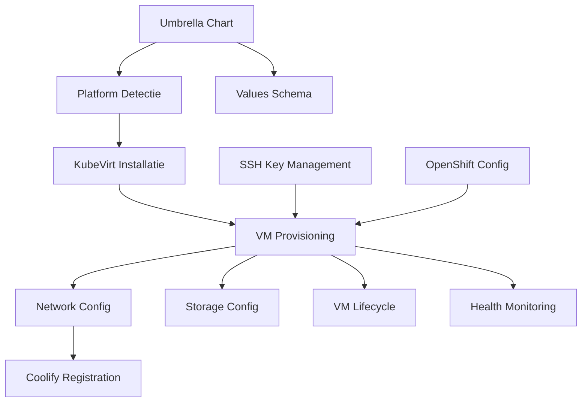

# Requirements Document: KubeVirt Integratie voor Coolify

## Introductie

Dit document beschrijft de requirements voor het integreren van KubeVirt met Coolify, waardoor Docker host VMs automatisch binnen Kubernetes clusters kunnen worden aangemaakt en beheerd. Deze integratie maakt het mogelijk om Coolify volledig op Kubernetes te draaien zonder externe Docker servers, door VMs als deployment targets te gebruiken.

### Probleemstelling

Coolify draait op Kubernetes (via Helm chart), maar applicaties moeten nog steeds naar externe Docker servers worden gedeployed via SSH. Dit vereist:
- Aparte VM infrastructuur buiten Kubernetes
- Handmatig beheer van Docker hosts
- Complexe netwerkconfiguratie tussen Kubernetes en externe VMs

### Oplossing

Door KubeVirt te integreren kunnen Docker host VMs **binnen** het Kubernetes cluster draaien:
- Alles op één platform (Kubernetes)
- Automatische provisioning van Docker hosts
- Geïntegreerd netwerk (Kubernetes Services)
- Automatische registratie in Coolify

### Scope

Deze specificatie omvat:
1. Automatische KubeVirt installatie (voor niet-OpenShift platforms)
2. Docker Host VM provisioning via VirtualMachine CRs
3. VM lifecycle management (create, start, stop, delete, scale)
4. Automatische Coolify server registratie
5. Umbrella Helm Chart voor one-click deployment
6. Multi-platform ondersteuning (OpenShift, OKD, K3s, vanilla Kubernetes)

### Uitgesloten van Scope

- Wijzigingen aan de core Coolify deployment logica
- Kubernetes als directe deployment target (zie aparte spec: kubernetes-support)
- GPU passthrough voor VMs
- Live VM migration

## Glossarium

| Term | Definitie |
|------|-----------|
| **KubeVirt** | Kubernetes add-on voor het draaien van VMs als Kubernetes pods |
| **VirtualMachine (VM)** | KubeVirt Custom Resource voor VM definitie (persistent) |
| **VirtualMachineInstance (VMI)** | Running instance van een VirtualMachine |
| **CDI** | Containerized Data Importer - tool voor importeren van VM disk images |
| **DataVolume** | CDI resource voor disk provisioning en import |
| **ContainerDisk** | Ephemeral disk source vanuit container image |
| **cloud-init** | Standaard voor VM initialisatie en configuratie |
| **virtctl** | CLI tool voor KubeVirt operaties |
| **OpenShift Virtualization** | Red Hat's ondersteunde KubeVirt distributie |
| **Umbrella Chart** | Helm chart die meerdere subcharts orchestreert |
| **Docker Host VM** | VM met Docker daemon die als Coolify deployment target dient |
| **SCC** | Security Context Constraints (OpenShift security mechanisme) |

## Architectuur Overzicht

```
┌─────────────────────────────────────────────────────────────────────────────┐
│                         Kubernetes Cluster                                   │
│                                                                              │
│  ┌─────────────────────────────────────────────────────────────────────┐    │
│  │                     coolify-platform (Umbrella Helm Chart)          │    │
│  │                                                                      │    │
│  │  ┌────────────────────┐    ┌─────────────────────────────────────┐  │    │
│  │  │  coolify namespace │    │      coolify-vms namespace          │  │    │
│  │  │                    │    │                                     │  │    │
│  │  │  ┌──────────────┐  │    │  ┌─────────────────────────────┐   │  │    │
│  │  │  │ Coolify      │  │SSH │  │  VirtualMachine:            │   │  │    │
│  │  │  │ Control Plane│──┼────┼──│  docker-host-0              │   │  │    │
│  │  │  │              │  │    │  │  ┌───────────────────────┐  │   │  │    │
│  │  │  │ - Web UI     │  │    │  │  │ Fedora/Ubuntu VM      │  │   │  │    │
│  │  │  │ - API        │  │    │  │  │ - Docker Engine       │  │   │  │    │
│  │  │  │ - Horizon    │  │    │  │  │ - SSH Server          │  │   │  │    │
│  │  │  │ - Soketi     │  │    │  │  │ - Coolify User        │  │   │  │    │
│  │  │  └──────────────┘  │    │  │  └───────────────────────┘  │   │  │    │
│  │  │                    │    │  └─────────────────────────────┘   │  │    │
│  │  │  ┌──────────────┐  │    │                                     │  │    │
│  │  │  │ PostgreSQL   │  │    │  ┌─────────────────────────────┐   │  │    │
│  │  │  │ Redis        │  │    │  │  VirtualMachine:            │   │  │    │
│  │  │  │ (StatefulSet)│  │    │  │  docker-host-1              │   │  │    │
│  │  │  └──────────────┘  │    │  │  (meer capacity)            │   │  │    │
│  │  └────────────────────┘    │  └─────────────────────────────┘   │  │    │
│  │                            └─────────────────────────────────────┘  │    │
│  └─────────────────────────────────────────────────────────────────────┘    │
│                                                                              │
│  ┌─────────────────────────────────────────────────────────────────────┐    │
│  │  kubevirt namespace (KubeVirt Components)                           │    │
│  │  virt-operator | virt-controller | virt-handler | virt-api         │    │
│  └─────────────────────────────────────────────────────────────────────┘    │
└─────────────────────────────────────────────────────────────────────────────┘
```

## Requirements

---

### Requirement 1: Platform Detectie en Compatibiliteit

**User Story:** Als een platform engineer wil ik dat de installatie automatisch detecteert welk Kubernetes platform wordt gebruikt, zodat de juiste installatiemethode wordt toegepast.

#### Acceptance Criteria

1.1. WHEN de Helm chart wordt geïnstalleerd, THE installer SHALL detecteren of het platform OpenShift/OKD is door te checken op de aanwezigheid van de `route.openshift.io` API group

1.2. WHEN OpenShift/OKD wordt gedetecteerd, THE installer SHALL de KubeVirt installatie overslaan en ervan uitgaan dat OpenShift Virtualization via OperatorHub wordt geïnstalleerd

1.3. WHEN vanilla Kubernetes of K3s wordt gedetecteerd, THE installer SHALL community KubeVirt automatisch installeren

1.4. THE installer SHALL ondersteuning bieden voor de volgende platforms:
   - Kubernetes 1.23+
   - K3s 1.23+
   - K3d (K3s in Docker)
   - OKD 4.10+
   - Red Hat OpenShift 4.10+
   - Rancher RKE2

1.5. WHEN het platform niet wordt herkend, THE installer SHALL een warning loggen en doorgaan met standaard Kubernetes installatie

1.6. THE installer SHALL platform-specifieke values files aanbieden:
   - `values.yaml` (default Kubernetes)
   - `values-k3s.yaml`
   - `values-okd.yaml`
   - `values-openshift.yaml`

#### Technische Details

- Platform detectie via: `kubectl api-resources | grep route.openshift.io`
- K3s detectie via: aanwezigheid van `k3s` in node labels of `k3s.io` annotations
- Fallback naar generieke Kubernetes indien onbekend

---

### Requirement 2: KubeVirt Automatische Installatie

**User Story:** Als een platform engineer wil ik dat KubeVirt automatisch wordt geïnstalleerd als onderdeel van de Helm deployment, zodat ik geen handmatige stappen hoef uit te voeren.

#### Acceptance Criteria

2.1. WHEN KubeVirt niet aanwezig is op het cluster, THE installer SHALL KubeVirt operator en CR installeren als pre-install Helm hook

2.2. WHEN KubeVirt al aanwezig is, THE installer SHALL de installatie overslaan en de bestaande installatie gebruiken

2.3. THE installer SHALL wachten tot KubeVirt volledig operationeel is voordat de Helm installatie doorgaat (max timeout: 10 minuten)

2.4. THE installer SHALL CDI (Containerized Data Importer) installeren samen met KubeVirt voor disk image management

2.5. WHEN de KubeVirt installatie faalt, THE installer SHALL een duidelijke foutmelding geven met troubleshooting stappen

2.6. THE installer SHALL de volgende KubeVirt versie strategie volgen:
   - Default: latest stable release
   - Configureerbaar via `kubevirt.version` value
   - Minimum versie: v1.0.0

2.7. IF het cluster geen KVM ondersteuning heeft, THEN THE installer SHALL een duidelijke error tonen met de melding dat bare metal of nested virtualization vereist is

#### Technische Details

**Pre-install Job specificatie:**
```yaml
apiVersion: batch/v1
kind: Job
metadata:
  name: kubevirt-installer
  annotations:
    "helm.sh/hook": pre-install
    "helm.sh/hook-weight": "-10"
    "helm.sh/hook-delete-policy": hook-succeeded
spec:
  backoffLimit: 3
  ttlSecondsAfterFinished: 300
  template:
    spec:
      serviceAccountName: kubevirt-installer
      containers:
      - name: installer
        image: bitnami/kubectl:latest
        command: ["/bin/sh", "-c"]
        args:
        - |
          # Check KVM support
          # Install KubeVirt operator
          # Install KubeVirt CR
          # Install CDI
          # Wait for ready state
      restartPolicy: OnFailure
```

**Vereiste RBAC permissions voor installer:**
- `create`, `get`, `list` op `namespaces`
- `create`, `get`, `list`, `watch` op alle KubeVirt CRDs
- `create`, `get`, `list` op `deployments`, `services` in kubevirt namespace

---

### Requirement 3: Docker Host VM Provisioning

**User Story:** Als een Coolify gebruiker wil ik dat Docker host VMs automatisch worden aangemaakt en geconfigureerd, zodat ik direct applicaties kan deployen.

#### Acceptance Criteria

3.1. WHEN de Helm chart wordt geïnstalleerd met `dockerHosts.enabled: true`, THE chart SHALL het geconfigureerde aantal Docker host VMs aanmaken

3.2. EACH Docker host VM SHALL de volgende componenten bevatten:
   - Linux besturingssysteem (Fedora 40 default, configureerbaar)
   - Docker Engine (latest stable)
   - Docker Compose plugin
   - SSH server (OpenSSH)
   - Coolify user met sudo rechten
   - SSH authorized_keys geconfigureerd

3.3. THE VM configuratie SHALL de volgende parameters ondersteunen:
   - `dockerHosts.count` - aantal VMs (default: 1, max: 10)
   - `dockerHosts.namePrefix` - prefix voor VM namen (default: "docker-host")
   - `dockerHosts.resources.cores` - CPU cores per VM (default: 2)
   - `dockerHosts.resources.memory` - RAM per VM (default: 4Gi)
   - `dockerHosts.resources.disk` - Disk grootte per VM (default: 50Gi)
   - `dockerHosts.image` - Base OS image (default: quay.io/containerdisks/fedora:40)
   - `dockerHosts.storageClass` - Storage class voor disks (default: cluster default)

3.4. THE VMs SHALL worden aangemaakt in een dedicated namespace (`coolify-vms` default, configureerbaar)

3.5. WHEN een VM wordt aangemaakt, THE provisioning SHALL cloud-init gebruiken voor initiële configuratie

3.6. THE cloud-init configuratie SHALL idempotent zijn - herhaald toepassen resulteert in dezelfde eindstatus

3.7. WHEN Docker installatie faalt in de VM, THE VM SHALL een unhealthy status krijgen en een event loggen

#### Technische Details

**VirtualMachine CR Template:**
```yaml
apiVersion: kubevirt.io/v1
kind: VirtualMachine
metadata:
  name: {{ .namePrefix }}-{{ .index }}
  namespace: {{ .namespace }}
  labels:
    app.kubernetes.io/name: coolify-docker-host
    app.kubernetes.io/instance: {{ .Release.Name }}
    app.kubernetes.io/component: docker-host
    coolify.io/docker-host: "true"
    coolify.io/host-index: "{{ .index }}"
spec:
  running: true
  template:
    metadata:
      labels:
        kubevirt.io/vm: {{ .namePrefix }}-{{ .index }}
        coolify.io/docker-host: "true"
    spec:
      domain:
        cpu:
          cores: {{ .resources.cores }}
        memory:
          guest: {{ .resources.memory }}
        devices:
          disks:
            - name: rootdisk
              disk:
                bus: virtio
            - name: cloudinit
              disk:
                bus: virtio
          interfaces:
            - name: default
              masquerade: {}
        resources:
          requests:
            memory: {{ .resources.memory }}
      networks:
        - name: default
          pod: {}
      volumes:
        - name: rootdisk
          dataVolume:
            name: {{ .namePrefix }}-{{ .index }}-rootdisk
        - name: cloudinit
          cloudInitNoCloud:
            secretRef:
              name: {{ .namePrefix }}-cloudinit
```

**Cloud-init ConfigMap/Secret:**
```yaml
#cloud-config
hostname: {{ .hostname }}
fqdn: {{ .hostname }}.{{ .namespace }}.svc.cluster.local

# User configuratie
users:
  - name: coolify
    groups: [docker, sudo, wheel]
    shell: /bin/bash
    sudo: ['ALL=(ALL) NOPASSWD:ALL']
    ssh_authorized_keys:
      - {{ .sshPublicKey }}

# Package installatie
package_update: true
package_upgrade: true
packages:
  - docker
  - docker-compose
  - curl
  - git
  - htop
  - vim

# Docker configuratie
runcmd:
  - systemctl enable docker
  - systemctl start docker
  - usermod -aG docker coolify
  # Health check marker
  - touch /var/lib/cloud/instance/boot-finished

# Final message
final_message: "Docker host ready after $UPTIME seconds"
```

---

### Requirement 4: SSH Key Management

**User Story:** Als een Coolify beheerder wil ik dat SSH keys automatisch worden gegenereerd en beheerd, zodat veilige communicatie tussen Coolify en Docker hosts gegarandeerd is.

#### Acceptance Criteria

4.1. WHEN `dockerHosts.sshKey.generate: true`, THE chart SHALL een nieuw Ed25519 SSH keypair genereren

4.2. WHEN `dockerHosts.sshKey.existingSecret` is opgegeven, THE chart SHALL de bestaande secret gebruiken voor SSH keys

4.3. THE SSH private key SHALL worden opgeslagen in een Kubernetes Secret met type `kubernetes.io/ssh-auth`

4.4. THE SSH public key SHALL worden geïnjecteerd in de VM cloud-init configuratie

4.5. THE SSH private key Secret SHALL alleen leesbaar zijn voor de Coolify service account

4.6. WHEN SSH keys worden gegenereerd, THE chart SHALL een annotation toevoegen met de generatie timestamp

4.7. THE SSH key Secret SHALL NIET worden verwijderd bij helm uninstall (annotatie: `helm.sh/resource-policy: keep`)

4.8. IF een bestaande SSH key secret niet bestaat, THEN THE chart SHALL falen met een duidelijke foutmelding

#### Technische Details

**SSH Key Generation Job:**
```yaml
apiVersion: batch/v1
kind: Job
metadata:
  name: ssh-key-generator
  annotations:
    "helm.sh/hook": pre-install
    "helm.sh/hook-weight": "-5"
spec:
  template:
    spec:
      containers:
      - name: keygen
        image: alpine:3.19
        command:
        - /bin/sh
        - -c
        - |
          apk add --no-cache openssh-keygen
          ssh-keygen -t ed25519 -f /keys/id_ed25519 -N "" -C "coolify@kubernetes"
          # Create secret via kubectl or output for Helm
        volumeMounts:
        - name: keys
          mountPath: /keys
      restartPolicy: OnFailure
```

**SSH Secret Structure:**
```yaml
apiVersion: v1
kind: Secret
metadata:
  name: coolify-docker-host-ssh
  annotations:
    coolify.io/generated-at: "{{ now }}"
    helm.sh/resource-policy: keep
type: kubernetes.io/ssh-auth
data:
  ssh-privatekey: {{ .privateKey | b64enc }}
  ssh-publickey: {{ .publicKey | b64enc }}
```

---

### Requirement 5: VM Netwerk Configuratie

**User Story:** Als een Coolify gebruiker wil ik dat Docker host VMs bereikbaar zijn vanuit de Coolify control plane, zodat SSH verbindingen kunnen worden opgezet.

#### Acceptance Criteria

5.1. EACH Docker host VM SHALL een Kubernetes Service krijgen voor SSH toegang (port 22)

5.2. THE Service type SHALL configureerbaar zijn:
   - `ClusterIP` (default) - alleen binnen cluster bereikbaar
   - `NodePort` - bereikbaar via node IP
   - `LoadBalancer` - externe LoadBalancer (cloud providers)

5.3. THE Service DNS name SHALL het formaat volgen: `{{ .vmName }}-ssh.{{ .namespace }}.svc.cluster.local`

5.4. WHEN meerdere VMs worden aangemaakt, EACH VM SHALL een unieke Service krijgen

5.5. THE chart SHALL optioneel een headless Service aanmaken voor direct pod DNS

5.6. IF `dockerHosts.network.hostNetwork: true`, THEN THE VM SHALL host networking gebruiken (niet aanbevolen)

5.7. THE VM netwerk interface SHALL masquerade mode gebruiken voor outbound connectivity

5.8. WHEN de VM een IP adres krijgt, THE Service endpoints SHALL automatisch worden bijgewerkt

#### Technische Details

**Service Template:**
```yaml
apiVersion: v1
kind: Service
metadata:
  name: {{ .vmName }}-ssh
  namespace: {{ .namespace }}
  labels:
    app.kubernetes.io/name: coolify-docker-host
    coolify.io/docker-host: "true"
spec:
  type: {{ .serviceType }}
  selector:
    kubevirt.io/vm: {{ .vmName }}
  ports:
    - name: ssh
      port: 22
      targetPort: 22
      {{- if eq .serviceType "NodePort" }}
      nodePort: {{ .nodePort }}
      {{- end }}
```

**DNS Resolution binnen cluster:**
- VM bereikbaar via: `docker-host-0-ssh.coolify-vms.svc.cluster.local`
- Coolify moet deze DNS naam gebruiken als server IP

---

### Requirement 6: VM Lifecycle Management

**User Story:** Als een Coolify beheerder wil ik Docker host VMs kunnen starten, stoppen en verwijderen, zodat ik resources kan beheren.

#### Acceptance Criteria

6.1. WHEN `helm upgrade` wordt uitgevoerd met een hoger `dockerHosts.count`, THE chart SHALL nieuwe VMs aanmaken

6.2. WHEN `helm upgrade` wordt uitgevoerd met een lager `dockerHosts.count`, THE chart SHALL een warning tonen maar NIET automatisch VMs verwijderen

6.3. THE chart SHALL de volgende lifecycle operaties ondersteunen via annotations:
   - `coolify.io/vm-action: stop` - VM stoppen
   - `coolify.io/vm-action: start` - VM starten
   - `coolify.io/vm-action: restart` - VM herstarten

6.4. WHEN een VM wordt gestopt, THE VM state SHALL behouden blijven (disk data persistent)

6.5. WHEN een VM wordt verwijderd, THE chart SHALL eerst controleren of de VM geregistreerd is in Coolify en een warning tonen

6.6. THE chart SHALL een `cleanupJob` ondersteunen voor het veilig verwijderen van VMs:
   - De-registratie in Coolify
   - Stoppen van running containers in VM
   - Verwijderen van VM en DataVolume

6.7. WHEN de VirtualMachine CR wordt verwijderd, THE DataVolume SHALL ook worden verwijderd (ownerReference)

#### Technische Details

**Scaling strategie:**
```yaml
# values.yaml
dockerHosts:
  count: 3

  scaling:
    # Prevent accidental deletion
    preventScaleDown: true

    # Grace period before VM deletion
    terminationGracePeriodSeconds: 300
```

**Cleanup Job:**
```yaml
apiVersion: batch/v1
kind: Job
metadata:
  name: cleanup-docker-host-{{ .index }}
  annotations:
    "helm.sh/hook": pre-delete
    "helm.sh/hook-weight": "-5"
spec:
  template:
    spec:
      containers:
      - name: cleanup
        image: curlimages/curl:latest
        command:
        - /bin/sh
        - -c
        - |
          # Call Coolify API to deregister server
          # Gracefully stop containers in VM
          # Signal ready for deletion
```

---

### Requirement 7: Automatische Coolify Server Registratie

**User Story:** Als een Coolify gebruiker wil ik dat Docker host VMs automatisch worden geregistreerd in Coolify, zodat ik direct applicaties kan deployen zonder handmatige configuratie.

#### Acceptance Criteria

7.1. WHEN een Docker host VM ready is, THE registration job SHALL de VM automatisch registreren in Coolify via de API

7.2. THE registration SHALL wachten tot:
   - De VM volledig is opgestart (cloud-init complete)
   - Docker daemon draait
   - SSH bereikbaar is

7.3. THE registration SHALL de volgende gegevens naar Coolify sturen:
   - Server naam: `{{ .vmName }}`
   - IP/Hostname: `{{ .vmName }}-ssh.{{ .namespace }}.svc.cluster.local`
   - SSH Port: `22`
   - SSH User: `coolify`
   - SSH Private Key: vanuit Secret

7.4. WHEN registratie faalt, THE job SHALL retries uitvoeren met exponential backoff (max 5 retries)

7.5. THE registration job SHALL pas starten nadat Coolify zelf ready is (post-install hook)

7.6. WHEN een VM wordt geregistreerd, THE job SHALL de server ID opslaan in een ConfigMap voor referentie

7.7. IF Coolify API credentials niet beschikbaar zijn, THEN THE registration SHALL worden overgeslagen met een warning

7.8. THE registration SHALL idempotent zijn - herhaalde registratie van dezelfde VM creëert geen duplicaten

#### Technische Details

**Registration Job:**
```yaml
apiVersion: batch/v1
kind: Job
metadata:
  name: register-docker-hosts
  annotations:
    "helm.sh/hook": post-install,post-upgrade
    "helm.sh/hook-weight": "10"
    "helm.sh/hook-delete-policy": hook-succeeded
spec:
  backoffLimit: 5
  template:
    spec:
      containers:
      - name: register
        image: curlimages/curl:latest
        env:
        - name: COOLIFY_URL
          value: "http://coolify.{{ .Release.Namespace }}.svc.cluster.local"
        - name: COOLIFY_API_TOKEN
          valueFrom:
            secretKeyRef:
              name: coolify-api-credentials
              key: token
              optional: true
        - name: SSH_PRIVATE_KEY
          valueFrom:
            secretKeyRef:
              name: coolify-docker-host-ssh
              key: ssh-privatekey
        command:
        - /bin/sh
        - -c
        - |
          # Wait for Coolify to be ready
          echo "Waiting for Coolify..."
          until curl -sf ${COOLIFY_URL}/api/health; do
            sleep 10
          done

          # Wait for each VM to be ready
          for i in $(seq 0 {{ sub .dockerHosts.count 1 }}); do
            VM_NAME="{{ .dockerHosts.namePrefix }}-${i}"
            VM_HOST="${VM_NAME}-ssh.{{ .vmNamespace }}.svc.cluster.local"

            echo "Waiting for ${VM_NAME}..."
            until nc -z ${VM_HOST} 22; do
              sleep 5
            done

            # Check Docker is running
            until ssh -o StrictHostKeyChecking=no -i /ssh/id_ed25519 \
              coolify@${VM_HOST} "docker info" >/dev/null 2>&1; do
              sleep 5
            done

            # Register with Coolify
            if [ -n "${COOLIFY_API_TOKEN}" ]; then
              curl -X POST ${COOLIFY_URL}/api/v1/servers \
                -H "Authorization: Bearer ${COOLIFY_API_TOKEN}" \
                -H "Content-Type: application/json" \
                -d "{
                  \"name\": \"${VM_NAME}\",
                  \"ip\": \"${VM_HOST}\",
                  \"port\": 22,
                  \"user\": \"coolify\",
                  \"private_key\": \"$(cat /ssh/id_ed25519 | base64 -w0)\"
                }"
              echo "Registered ${VM_NAME}"
            else
              echo "Warning: No API token, skipping registration for ${VM_NAME}"
            fi
          done
        volumeMounts:
        - name: ssh-key
          mountPath: /ssh
          readOnly: true
      volumes:
      - name: ssh-key
        secret:
          secretName: coolify-docker-host-ssh
          defaultMode: 0400
      restartPolicy: OnFailure
```

**Coolify API Credentials Secret:**
```yaml
apiVersion: v1
kind: Secret
metadata:
  name: coolify-api-credentials
type: Opaque
stringData:
  token: "{{ .Values.coolify.apiToken }}"
```

---

### Requirement 8: VM Health Monitoring

**User Story:** Als een Coolify beheerder wil ik de status van Docker host VMs kunnen monitoren, zodat ik problemen snel kan detecteren.

#### Acceptance Criteria

8.1. EACH Docker host VM SHALL een health status hebben die wordt gemonitord

8.2. THE health check SHALL de volgende aspecten verifiëren:
   - VM is running (VMI status)
   - SSH is bereikbaar (port 22)
   - Docker daemon is actief (`docker info`)
   - Voldoende disk space (>10% vrij)
   - Voldoende memory (>10% vrij)

8.3. WHEN een health check faalt, THE system SHALL:
   - Een Kubernetes Event aanmaken
   - De VM status updaten naar "Unhealthy"
   - Optioneel: een notification sturen (indien geconfigureerd)

8.4. THE health check interval SHALL configureerbaar zijn (default: 60 seconden)

8.5. WHEN een VM 3 opeenvolgende health checks faalt, THE system SHALL de VM als "Critical" markeren

8.6. THE health status SHALL zichtbaar zijn via:
   - Kubernetes labels op de VirtualMachine CR
   - Custom metrics (indien Prometheus beschikbaar)
   - Coolify UI (via server status)

8.7. WHEN een VM recovered van unhealthy status, THE system SHALL een recovery event loggen

#### Technische Details

**Health Check CronJob:**
```yaml
apiVersion: batch/v1
kind: CronJob
metadata:
  name: docker-host-health-check
spec:
  schedule: "*/1 * * * *"  # Every minute
  concurrencyPolicy: Forbid
  jobTemplate:
    spec:
      template:
        spec:
          containers:
          - name: healthcheck
            image: alpine:3.19
            command:
            - /bin/sh
            - -c
            - |
              apk add --no-cache openssh-client curl

              for vm in $(kubectl get vm -l coolify.io/docker-host=true -o name); do
                VM_NAME=$(echo $vm | cut -d/ -f2)
                VM_HOST="${VM_NAME}-ssh.coolify-vms.svc.cluster.local"

                # Check SSH
                if ! nc -z ${VM_HOST} 22 2>/dev/null; then
                  kubectl label vm ${VM_NAME} coolify.io/health=unhealthy --overwrite
                  continue
                fi

                # Check Docker
                if ! ssh -o StrictHostKeyChecking=no coolify@${VM_HOST} \
                  "docker info" >/dev/null 2>&1; then
                  kubectl label vm ${VM_NAME} coolify.io/health=unhealthy --overwrite
                  continue
                fi

                kubectl label vm ${VM_NAME} coolify.io/health=healthy --overwrite
              done
          restartPolicy: OnFailure
```

---

### Requirement 9: Storage Configuratie

**User Story:** Als een Coolify beheerder wil ik de storage configuratie voor Docker host VMs kunnen aanpassen, zodat ik voldoende ruimte heb voor containers en images.

#### Acceptance Criteria

9.1. THE VM root disk SHALL geconfigureerd worden via DataVolume met configureerbare grootte

9.2. THE storage class SHALL configureerbaar zijn per VM of globaal:
   - `dockerHosts.storageClass` - voor alle VMs
   - Via annotation per VM voor override

9.3. THE chart SHALL ondersteuning bieden voor de volgende disk sources:
   - `containerDisk` - ephemeral, vanuit container image (default voor dev)
   - `dataVolume` - persistent, met CDI import (default voor prod)
   - `persistentVolumeClaim` - bestaande PVC

9.4. WHEN `dataVolume` wordt gebruikt, THE CDI import SHALL wachten tot complete voordat VM start

9.5. THE disk bus type SHALL `virtio` zijn voor optimale performance

9.6. OPTIONAL: Extra data disks kunnen worden toegevoegd voor `/var/lib/docker`:
   - `dockerHosts.extraDisks[].name`
   - `dockerHosts.extraDisks[].size`
   - `dockerHosts.extraDisks[].mountPath`

9.7. WHEN storage provisioning faalt, THE chart SHALL een duidelijke error tonen met de storage class status

#### Technische Details

**DataVolume Template:**
```yaml
apiVersion: cdi.kubevirt.io/v1beta1
kind: DataVolume
metadata:
  name: {{ .vmName }}-rootdisk
  namespace: {{ .namespace }}
  ownerReferences:
  - apiVersion: kubevirt.io/v1
    kind: VirtualMachine
    name: {{ .vmName }}
    uid: {{ .vmUID }}
spec:
  source:
    registry:
      url: "docker://{{ .image }}"
  pvc:
    accessModes:
      - ReadWriteOnce
    resources:
      requests:
        storage: {{ .diskSize }}
    {{- if .storageClass }}
    storageClassName: {{ .storageClass }}
    {{- end }}
```

**Extra Docker Data Disk:**
```yaml
# cloud-init voor mount
mounts:
  - [ /dev/vdb, /var/lib/docker, ext4, "defaults,noatime", "0", "2" ]

runcmd:
  - mkfs.ext4 /dev/vdb
  - mkdir -p /var/lib/docker
  - mount /dev/vdb /var/lib/docker
```

---

### Requirement 10: OpenShift Specifieke Configuratie

**User Story:** Als een OpenShift beheerder wil ik dat de chart correct werkt met OpenShift security en networking, zodat de installatie voldoet aan enterprise requirements.

#### Acceptance Criteria

10.1. WHEN OpenShift wordt gedetecteerd, THE chart SHALL OpenShift Routes gebruiken in plaats van Ingress (voor Coolify UI)

10.2. THE chart SHALL Security Context Constraints (SCC) correct afhandelen:
   - Coolify pods: `anyuid` SCC vereist
   - KubeVirt: managed door OpenShift Virtualization operator

10.3. WHEN `openshift.createSCC: true`, THE chart SHALL een custom SCC aanmaken met de benodigde permissions

10.4. THE chart SHALL documentatie bevatten voor het toekennen van SCC aan service accounts:
   ```bash
   oc adm policy add-scc-to-user anyuid -z coolify -n coolify
   ```

10.5. WHEN OpenShift Virtualization operator niet is geïnstalleerd, THE chart SHALL een pre-flight check falen met installatie instructies

10.6. THE chart SHALL OpenShift-specifieke image sources ondersteunen:
   - Red Hat certified images
   - Internal OpenShift registry

10.7. WHEN NetworkPolicy is enabled in OpenShift, THE chart SHALL NetworkPolicy resources aanmaken voor communicatie tussen namespaces

#### Technische Details

**NetworkPolicy voor cross-namespace communicatie:**
```yaml
apiVersion: networking.k8s.io/v1
kind: NetworkPolicy
metadata:
  name: allow-coolify-to-vms
  namespace: {{ .vmNamespace }}
spec:
  podSelector:
    matchLabels:
      coolify.io/docker-host: "true"
  policyTypes:
    - Ingress
  ingress:
    - from:
        - namespaceSelector:
            matchLabels:
              kubernetes.io/metadata.name: {{ .coolifyNamespace }}
      ports:
        - protocol: TCP
          port: 22
```

---

### Requirement 11: Umbrella Helm Chart Structuur

**User Story:** Als een platform engineer wil ik een single Helm chart die alle componenten installeert, zodat de deployment eenvoudig en reproduceerbaar is.

#### Acceptance Criteria

11.1. THE umbrella chart SHALL de volgende structuur hebben:
```
coolify-platform/
├── Chart.yaml
├── Chart.lock
├── values.yaml
├── values-k3s.yaml
├── values-okd.yaml
├── values-openshift.yaml
├── templates/
│   ├── _helpers.tpl
│   ├── namespace.yaml
│   ├── NOTES.txt
│   ├── pre-install/
│   │   ├── rbac.yaml
│   │   ├── kubevirt-installer.yaml
│   │   └── ssh-keygen.yaml
│   ├── docker-hosts/
│   │   ├── virtualmachine.yaml
│   │   ├── datavolume.yaml
│   │   ├── service.yaml
│   │   ├── cloudinit-secret.yaml
│   │   └── networkpolicy.yaml
│   └── post-install/
│       ├── registration-job.yaml
│       └── health-cronjob.yaml
└── charts/
    └── coolify/              # Bestaande Coolify chart als dependency
```

11.2. THE chart SHALL Coolify als subchart/dependency opnemen

11.3. THE Chart.yaml SHALL de correcte dependencies definiëren:
```yaml
dependencies:
  - name: coolify
    version: "0.1.x"
    repository: "file://./charts/coolify"
    condition: coolify.enabled
```

11.4. THE chart SHALL alle configuratie kunnen doorgeven aan de Coolify subchart via `coolify.*` values

11.5. THE chart SHALL een `NOTES.txt` bevatten met:
   - Post-install instructies
   - URL om Coolify te bereiken
   - Aantal geprovisioned Docker hosts
   - SSH key retrieval instructies
   - Troubleshooting tips

11.6. THE chart versioning SHALL SemVer volgen:
   - MAJOR: breaking changes
   - MINOR: nieuwe features, backward compatible
   - PATCH: bug fixes

#### Technische Details

**Chart.yaml:**
```yaml
apiVersion: v2
name: coolify-platform
description: |
  Complete Coolify deployment with KubeVirt-based Docker hosts.
  Supports Kubernetes, K3s, OKD, and OpenShift.
type: application
version: 0.1.0
appVersion: "4.0.0"
kubeVersion: ">=1.23.0-0"

keywords:
  - coolify
  - paas
  - kubevirt
  - docker
  - self-hosted

home: https://coolify.io
sources:
  - https://github.com/coollabsio/coolify

maintainers:
  - name: Coolify Community
    url: https://github.com/coollabsio/coolify

dependencies:
  - name: coolify
    version: ">=0.1.0"
    repository: "file://./charts/coolify"
    condition: coolify.enabled

annotations:
  artifacthub.io/category: integration-delivery
  artifacthub.io/license: Apache-2.0
  artifacthub.io/operator: "false"
  artifacthub.io/prerelease: "true"
```

---

### Requirement 12: Values Schema en Validatie

**User Story:** Als een platform engineer wil ik dat mijn configuratie wordt gevalideerd voordat de installatie start, zodat configuratiefouten vroeg worden gedetecteerd.

#### Acceptance Criteria

12.1. THE chart SHALL een `values.schema.json` bevatten voor JSON Schema validatie

12.2. THE schema SHALL de volgende validaties afdwingen:
   - `dockerHosts.count`: integer, min 0, max 10
   - `dockerHosts.resources.memory`: pattern match voor Kubernetes memory (bijv. "4Gi")
   - `dockerHosts.resources.cores`: integer, min 1, max 32
   - `dockerHosts.resources.disk`: pattern match voor storage (bijv. "50Gi")
   - `coolify.config.appUrl`: valid URL format

12.3. THE chart SHALL required fields definiëren:
   - `coolify.config.appUrl` (altijd required)
   - `ingress.host` OF `route.host` (afhankelijk van platform)

12.4. WHEN validatie faalt, THE helm install SHALL een duidelijke foutmelding tonen met het ongeldige veld

12.5. THE chart SHALL default values hebben voor alle optionele configuratie

12.6. THE values files SHALL uitgebreide comments bevatten die elke optie documenteren

#### Technische Details

**values.schema.json (excerpt):**
```json
{
  "$schema": "https://json-schema.org/draft-07/schema#",
  "type": "object",
  "required": ["coolify"],
  "properties": {
    "dockerHosts": {
      "type": "object",
      "properties": {
        "enabled": {
          "type": "boolean",
          "default": true,
          "description": "Enable Docker host VM provisioning"
        },
        "count": {
          "type": "integer",
          "minimum": 0,
          "maximum": 10,
          "default": 1,
          "description": "Number of Docker host VMs to create"
        },
        "resources": {
          "type": "object",
          "properties": {
            "cores": {
              "type": "integer",
              "minimum": 1,
              "maximum": 32,
              "default": 2
            },
            "memory": {
              "type": "string",
              "pattern": "^[0-9]+(Mi|Gi)$",
              "default": "4Gi"
            },
            "disk": {
              "type": "string",
              "pattern": "^[0-9]+(Mi|Gi|Ti)$",
              "default": "50Gi"
            }
          }
        }
      }
    },
    "coolify": {
      "type": "object",
      "required": ["config"],
      "properties": {
        "config": {
          "type": "object",
          "required": ["appUrl"],
          "properties": {
            "appUrl": {
              "type": "string",
              "format": "uri",
              "description": "Public URL for Coolify"
            }
          }
        }
      }
    }
  }
}
```

---

### Requirement 13: Observability en Logging

**User Story:** Als een platform engineer wil ik inzicht hebben in de status van alle componenten, zodat ik problemen kan diagnosticeren.

#### Acceptance Criteria

13.1. ALL Helm hooks en Jobs SHALL logs schrijven naar stdout/stderr voor Kubernetes log aggregatie

13.2. THE chart SHALL optioneel Prometheus ServiceMonitor resources aanmaken wanneer `monitoring.enabled: true`

13.3. THE following metrics SHALL worden geëxposeerd (indien monitoring enabled):
   - `coolify_docker_hosts_total` - totaal aantal VMs
   - `coolify_docker_hosts_healthy` - aantal healthy VMs
   - `coolify_docker_hosts_unhealthy` - aantal unhealthy VMs
   - `coolify_vm_cpu_usage` - CPU gebruik per VM
   - `coolify_vm_memory_usage` - Memory gebruik per VM

13.4. THE chart SHALL Kubernetes Events aanmaken voor belangrijke lifecycle events:
   - VM provisioning started/completed/failed
   - Registration started/completed/failed
   - Health check status changes

13.5. WHEN Grafana dashboards zijn gewenst, THE chart SHALL een ConfigMap met dashboard JSON kunnen aanmaken

13.6. ALL Jobs SHALL een `ttlSecondsAfterFinished` hebben zodat completed jobs automatisch worden opgeruimd

#### Technische Details

**ServiceMonitor Template:**
```yaml
{{- if .Values.monitoring.enabled }}
apiVersion: monitoring.coreos.com/v1
kind: ServiceMonitor
metadata:
  name: coolify-platform
  labels:
    {{- include "coolify-platform.labels" . | nindent 4 }}
spec:
  selector:
    matchLabels:
      app.kubernetes.io/name: coolify-platform
  endpoints:
    - port: metrics
      interval: 30s
      path: /metrics
{{- end }}
```

---

### Requirement 14: Backup en Disaster Recovery

**User Story:** Als een Coolify beheerder wil ik Docker host VMs kunnen backuppen, zodat ik kan herstellen na failures.

#### Acceptance Criteria

14.1. THE chart SHALL documentatie bevatten voor VM backup strategieën:
   - VolumeSnapshot (indien ondersteund door storage class)
   - VM export via virtctl
   - Backup van cloud-init configuratie

14.2. WHEN `backup.enabled: true`, THE chart SHALL VolumeSnapshotClass resources kunnen aanmaken

14.3. THE VM DataVolumes SHALL annotations hebben voor backup tools (bijv. Velero):
   ```yaml
   annotations:
     backup.velero.io/backup-volumes: "rootdisk"
   ```

14.4. THE chart SHALL een disaster recovery procedure documenteren:
   1. Restore Kubernetes resources (Velero/etcd backup)
   2. Restore DataVolumes
   3. Start VMs
   4. Verify Coolify connectivity

14.5. THE cloud-init configuratie en SSH keys SHALL apart worden opgeslagen voor snelle rebuild

14.6. WHEN een VM rebuild nodig is, THE chart SHALL een procedure ondersteunen voor het recreëren van een VM met dezelfde hostname en IP

---

### Requirement 15: Upgrade en Rollback Procedures

**User Story:** Als een platform engineer wil ik de chart veilig kunnen upgraden en terugdraaien, zodat updates zonder downtime kunnen worden uitgevoerd.

#### Acceptance Criteria

15.1. THE chart SHALL semantic versioning volgen voor backward compatibility

15.2. WHEN een upgrade wordt uitgevoerd, THE chart SHALL:
   - Bestaande VMs NIET automatisch herstart
   - Nieuwe configuratie alleen toepassen op nieuwe VMs
   - Een migration job uitvoeren indien schema changes

15.3. THE chart SHALL helm rollback ondersteunen:
   - Coolify deployment rollback
   - VM configuratie NIET automatisch terugdraaien (data safety)

15.4. THE NOTES.txt SHALL upgrade instructies bevatten:
   ```bash
   helm upgrade coolify-platform ./coolify-platform \
     --namespace coolify \
     --reuse-values \
     -f custom-values.yaml
   ```

15.5. WHEN breaking changes worden geïntroduceerd, THE chart SHALL:
   - Major version bump
   - Migration guide in CHANGELOG
   - Pre-upgrade hook voor data migration

15.6. THE chart SHALL een `helm test` hook bevatten voor post-upgrade validatie

#### Technische Details

**Helm Test Hook:**
```yaml
apiVersion: v1
kind: Pod
metadata:
  name: "{{ .Release.Name }}-test"
  annotations:
    "helm.sh/hook": test
    "helm.sh/hook-delete-policy": hook-succeeded
spec:
  containers:
    - name: test
      image: curlimages/curl:latest
      command:
        - /bin/sh
        - -c
        - |
          # Test Coolify health
          curl -sf http://coolify.{{ .Release.Namespace }}.svc/api/health || exit 1

          # Test VM SSH connectivity
          for i in $(seq 0 {{ sub .Values.dockerHosts.count 1 }}); do
            nc -z docker-host-${i}-ssh.coolify-vms.svc 22 || exit 1
          done

          echo "All tests passed!"
  restartPolicy: Never
```

---

### Requirement 16: Security Hardening

**User Story:** Als een security engineer wil ik dat de deployment voldoet aan security best practices, zodat de installatie veilig is.

#### Acceptance Criteria

16.1. ALL Secrets SHALL encrypted zijn at rest (Kubernetes Secret encryption)

16.2. THE SSH private key SHALL:
   - Alleen leesbaar zijn door geautoriseerde pods
   - Ed25519 encryptie gebruiken (niet RSA)
   - Geen passphrase hebben (voor automation)

16.3. THE Coolify API token (indien gebruikt) SHALL:
   - Opgeslagen zijn in een Kubernetes Secret
   - Minimal permissions hebben (alleen server registration)
   - Rotatable zijn zonder VM rebuild

16.4. THE VM network SHALL:
   - Geen host network gebruiken (default)
   - Masquerade mode voor isolation
   - Optional: NetworkPolicy voor ingress/egress control

16.5. THE chart SHALL Pod Security Standards ondersteunen:
   - Configureerbare securityContext
   - Non-root containers waar mogelijk
   - Read-only root filesystem waar mogelijk

16.6. THE VMs SHALL security hardening krijgen via cloud-init:
   - Automatic security updates enabled
   - SSH password authentication disabled
   - Firewall (firewalld/ufw) configured
   - Fail2ban installed (optional)

16.7. THE chart SHALL RBAC resources aanmaken met minimal permissions

#### Technische Details

**Security-hardened cloud-init:**
```yaml
#cloud-config
# Security hardening
ssh_pwauth: false
disable_root: true

# Automatic updates
package_update: true
package_upgrade: true
packages:
  - unattended-upgrades  # Debian/Ubuntu
  # OF
  - dnf-automatic        # Fedora

# Firewall
runcmd:
  # Enable firewall
  - systemctl enable --now firewalld
  - firewall-cmd --permanent --add-service=ssh
  - firewall-cmd --permanent --add-port=2375/tcp  # Docker (optional, internal only)
  - firewall-cmd --reload

  # SSH hardening
  - sed -i 's/#PermitRootLogin.*/PermitRootLogin no/' /etc/ssh/sshd_config
  - sed -i 's/#PasswordAuthentication.*/PasswordAuthentication no/' /etc/ssh/sshd_config
  - systemctl restart sshd
```

---

### Requirement 17: Documentatie

**User Story:** Als een gebruiker wil ik uitgebreide documentatie, zodat ik de chart correct kan installeren en configureren.

#### Acceptance Criteria

17.1. THE chart SHALL de volgende documentatie bevatten:
   - README.md met quick start guide
   - CHANGELOG.md met version history
   - values.yaml met inline comments voor alle opties
   - Architecture diagram

17.2. THE README SHALL de volgende secties bevatten:
   - Prerequisites (per platform)
   - Installation (per platform)
   - Configuration reference
   - Upgrading
   - Troubleshooting
   - FAQ

17.3. THE chart SHALL voorbeelden bevatten:
   - Minimal installation
   - Production installation met external databases
   - HA setup met meerdere VMs
   - GitOps setup met ArgoCD

17.4. THE troubleshooting guide SHALL common issues behandelen:
   - KubeVirt installation failures
   - VM boot failures
   - SSH connectivity issues
   - Registration failures
   - Storage provisioning errors

17.5. THE documentation SHALL beschikbaar zijn in:
   - English (primary)
   - Nederlands (optional, in separate files)

---

### Requirement 18: CI/CD Pipeline Integratie

**User Story:** Als een DevOps engineer wil ik de chart kunnen testen en deployen via CI/CD, zodat releases geautomatiseerd zijn.

#### Acceptance Criteria

18.1. THE repository SHALL een GitHub Actions workflow bevatten voor:
   - Helm lint
   - Helm template validation
   - Schema validation
   - Unit tests (helm-unittest)
   - Integration tests (kind/k3d cluster)

18.2. THE chart SHALL compatibel zijn met GitOps tools:
   - ArgoCD Application CR voorbeeld
   - Flux HelmRelease CR voorbeeld

18.3. THE chart SHALL gepubliceerd kunnen worden naar:
   - GitHub Container Registry (ghcr.io)
   - Artifact Hub
   - Custom Helm repository

18.4. THE CI pipeline SHALL de volgende checks uitvoeren:
   - `helm lint`
   - `helm template` met alle values files
   - `kubeval` of `kubeconform` voor manifest validation
   - Security scanning (trivy, kubesec)

18.5. THE chart SHALL een `.helmignore` bevatten die test en CI files excludeert

#### Technische Details

**GitHub Actions Workflow:**
```yaml
name: Helm Chart CI

on:
  push:
    paths:
      - 'charts/**'
  pull_request:
    paths:
      - 'charts/**'

jobs:
  lint:
    runs-on: ubuntu-latest
    steps:
      - uses: actions/checkout@v4
      - uses: azure/setup-helm@v3
      - run: helm lint charts/coolify-platform

  template:
    runs-on: ubuntu-latest
    steps:
      - uses: actions/checkout@v4
      - uses: azure/setup-helm@v3
      - run: |
          helm dependency update charts/coolify-platform
          helm template test charts/coolify-platform -f charts/coolify-platform/values-k3s.yaml
          helm template test charts/coolify-platform -f charts/coolify-platform/values-okd.yaml

  test:
    runs-on: ubuntu-latest
    steps:
      - uses: actions/checkout@v4
      - uses: azure/setup-helm@v3
      - uses: helm-unittest/helm-unittest-action@v1
        with:
          charts: charts/coolify-platform
```

---

## Non-Functional Requirements

### NFR-1: Performance

| Metric | Requirement |
|--------|-------------|
| VM boot time | < 3 minuten (cold start) |
| SSH ready time | < 30 seconden na VM boot |
| Docker ready time | < 60 seconden na VM boot |
| Registration time | < 30 seconden per VM |
| Total deployment time | < 15 minuten (Coolify + 2 VMs) |

### NFR-2: Reliability

| Metric | Requirement |
|--------|-------------|
| VM uptime | 99.9% (na initiële provisioning) |
| Health check interval | Configureerbaar, default 60s |
| Auto-recovery | VM restart bij 3 failed health checks |
| Data persistence | VM data survives pod restarts |

### NFR-3: Scalability

| Metric | Requirement |
|--------|-------------|
| Max VMs per cluster | 10 (soft limit, configureerbaar) |
| Max VMs per node | Beperkt door node resources |
| Horizontal scaling | Via `helm upgrade --set dockerHosts.count=N` |

### NFR-4: Resource Usage

| Component | CPU Request | Memory Request | Storage |
|-----------|-------------|----------------|---------|
| Docker Host VM (default) | 2 cores | 4Gi | 50Gi |
| KubeVirt operator | 100m | 256Mi | - |
| Installer jobs | 100m | 128Mi | - |
| Health check job | 50m | 64Mi | - |

### NFR-5: Compatibility

| Platform | Minimum Version | Tested Version |
|----------|-----------------|----------------|
| Kubernetes | 1.23 | 1.29 |
| K3s | 1.23 | 1.29 |
| OKD | 4.10 | 4.14 |
| OpenShift | 4.10 | 4.14 |
| Helm | 3.8 | 3.14 |
| KubeVirt | 1.0.0 | 1.2.0 |

---

## Prioritering

| Priority | Requirements |
|----------|--------------|
| **P0 - Must Have** | 1, 2, 3, 4, 5, 6, 7, 11 |
| **P1 - Should Have** | 8, 9, 10, 12, 16, 17 |
| **P2 - Nice to Have** | 13, 14, 15, 18 |

---

## Afhankelijkheden



---

## Risico's en Mitigaties

| Risico | Impact | Waarschijnlijkheid | Mitigatie |
|--------|--------|-------------------|-----------|
| KubeVirt niet beschikbaar op alle platforms | Hoog | Laag | Platform detectie, documentatie voor handmatige installatie |
| VM boot failures | Hoog | Medium | Retry logic, health checks, troubleshooting guide |
| Network connectivity issues | Hoog | Medium | NetworkPolicy templates, debugging tools |
| Storage provisioning failures | Medium | Medium | Multiple storage class support, clear error messages |
| SSH key compromise | Hoog | Laag | Key rotation procedure, minimal permissions |
| Coolify API changes | Medium | Medium | API version pinning, graceful degradation |

---

## Acceptance Test Plan

### Test 1: Fresh Installation on K3s
1. Start met lege K3s cluster
2. Run `helm install coolify-platform ./coolify-platform -f values-k3s.yaml`
3. Verify: KubeVirt installed, Coolify running, 1 VM running, VM registered

### Test 2: Fresh Installation on OKD
1. Start met lege OKD cluster met OpenShift Virtualization
2. Run SCC setup + `helm install`
3. Verify: Coolify running, 1 VM running, VM registered

### Test 3: Scaling Docker Hosts
1. Start met werkende installatie (1 VM)
2. Run `helm upgrade --set dockerHosts.count=3`
3. Verify: 3 VMs running, all registered in Coolify

### Test 4: VM Recovery
1. Start met werkende installatie
2. Delete VMI (simulate crash)
3. Verify: VM auto-restarts, health returns to healthy

### Test 5: Helm Upgrade
1. Start met werkende installatie v0.1.0
2. Run `helm upgrade` naar v0.2.0
3. Verify: Coolify updated, VMs unchanged, no data loss

### Test 6: Full Uninstall
1. Start met werkende installatie
2. Run `helm uninstall`
3. Verify: All resources deleted except PVCs (data retention)
